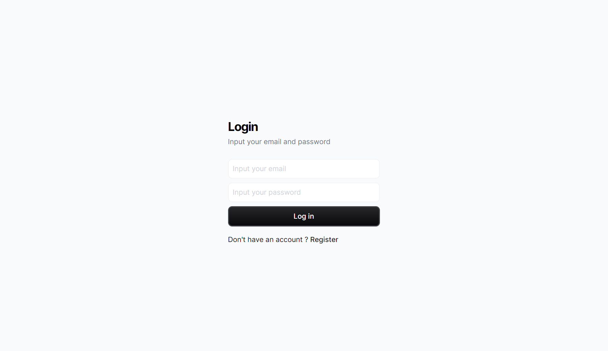

# Fork Note

This is a fork of `indrazm/BETH-STACK-Template`. That original repo is great and contains starter code for dealing with authentication and database systems. This repo is exactly the same as that but only contains the bare essentials for sending HTMX through Bun and Elysia. Call it the "BEH" stack if you'd like. I have left the rest of the README unaltered.

# BETH Stack Template

This is a template for a BETH stack project. It is a simple web application that uses the following technologies:

- [B]un.js
- [E]lysia
- [T]urso Database
- [H]TMX

Other technologies used:

- Typescripts
- Drizzle
- Tailwind CSS
- Kitajs
- Lucia Auth

## Getting Started

To get started, clone this repository and run `bun install` to install the dependencies. Then, run `bun start` to start the development server.
